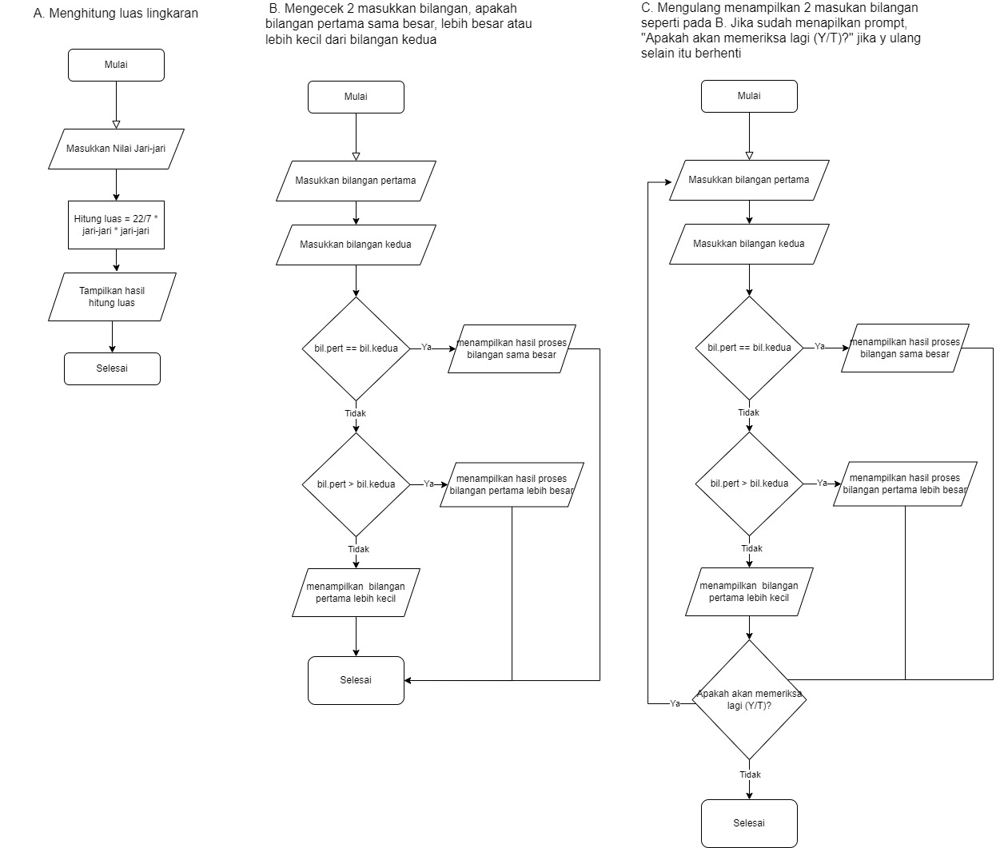

# JuniorWebDeveloper

Gowa, Tahun 2024
diadakan oleh [Digitalent](https://digitalent.kominfo.go.id/)

---

Website ini menampilkan halaman terkait dengan objek wisata di kabupaten Pinrang. Objek wisata ini bernama pantai lowita yang berada di [Kec. Suppa , Kab. Pinrang](https://maps.app.goo.gl/1fS6ETvU5MbQMCxm7).

Teknologi yang digunakan adalah HTML sederhana dan CSS tanpa bantuan framework, dengan sedikit javascript.

Sumber gambar: [Pemkab Pinrang](https://pinrangkab.go.id/wisata/pantai-lowita/)

---

> Tugas Pengayaan

## Algoritma

**Menghitung luas lingkaran**

1. Mulai
2. Masukkan nilai jari-jari
3. Proses luas = 22/7 _ jari-jari _ jari-jari
4. Tampilkan hasil proses hitung luas
5. Selesai

**Mengecek 2 masukkan bilangan, apakah bilangan pertama sama besar, lebih besar atau lebih kecil dari bilangan kedua**

1. Mulai
2. Masukkan bilangan pertama
3. Masukkan bilangan Kedua
4. Proses cek apakah bilangan pertama sama besar, jika ya maka lompat ke menampilkan hasil proses bilangan sama besar, jika tidak lanjutkan proses cek
5. Proses cek apakah bilangan pertama lebih besar dari bilangn kedua, jika ya maka lompat ke menampilkan hasil proses bilangan pertama lebih besar, jika tidak kirimkan hasil bahwa bilangan pertama lebih kecil dari bilangan kedua
6. Tampilkan hasil proses cek bilangan
7. Selesai

**Mengulang menampilkan 2 masukan bilangan seperti pada B. Jika sudah menapilkan prompt, "Apakah akan memeriksa lagi (Y/T)?" jika y ulang selain itu berhenti**

1. Mulai
2. Masukkan bilangan pertama
3. Masukkan bilangan Kedua
4. Proses cek apakah bilangan pertama sama besar, lebih besar, atau lebih kecil dari bilangan kedua
5. Tampilkan hasil proses cek bilangan
6. Tampilkan prompt "Apakah akan memeriksa lagi (Y/T)?"
7. Proses cek jawaban prompt, jika 'y' maka memeriksa lagi dimulai dari langkah 2. Jika prompt selain dari 'y' maka proggram dilanjutk ke langkah berikutnya
8. Selesai

## FlowChart

 

---

Sekian, Terima Kasih.
